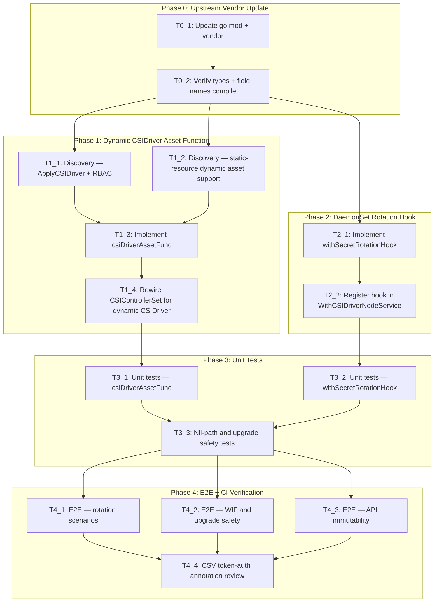

# Execution Backlog
**Feature:** Configurable Secret Rotation and Workload Identity Federation (SSCSI-254)
**AgentRoutingMode:** PROVIDED
**ConstitutionVersion:** 1.0.0 (ratified 2026-07-02)

---

## 0. Input coverage checklist

| Requirement / Phase | Covering Task IDs |
|---------------------|-------------------|
| FR-001: disable automatic rotation | T2_1, T2_2, T3_2 |
| FR-002: configure custom rotation interval | T2_1, T2_2, T3_2 |
| FR-003: upgrade no-op defaults | T2_1, T3_3, T4_2 |
| FR-004: configure WIF token audiences | T1_3, T1_4, T3_1 |
| FR-005: preserve Unmanaged tokenRequests on upgrade | T1_3, T1_4, T3_1, T3_3 |
| FR-006: Managed type immutability (API-level CEL) | T0_2 (verify in openshift/api), T4_3 |
| FR-007: rolling update non-disruption | T2_1, T3_3, T4_1 |
| FR-008: atomic CSIDriver apply (SSA) | T1_1, T1_3, T1_4 |
| FR-009: configuration survives restarts | T4_2 |
| SC-001: rotation disabled in DaemonSet within 1 reconcile + rolling update | T2_1, T4_1 |
| SC-002: custom interval reflected in DaemonSet args | T2_1, T3_2, T4_1 |
| SC-003: tokenRequests matches configured audiences | T1_3, T3_1, T4_2 |
| SC-004: upgrade no-op (no rolling update) | T3_3, T4_2 |
| SC-005: manually-patched tokenRequests preserved | T1_3, T3_3, T4_2 |
| SC-006: Managed→Unmanaged API rejection | T0_2, T4_3 |
| A-001: field name contingency (minimumRefreshAge vs rotationPollIntervalSeconds) | T0_1, T0_2 |
| A-002: RBAC pre-verified | T1_1 (combined with ApplyCSIDriver discovery) |
| Plan Phase 0: openshift/api vendor update | T0_1, T0_2 |
| Plan Phase 1: dynamic CSIDriver asset function | T1_1, T1_2, T1_3, T1_4 |
| Plan Phase 2: DaemonSet rotation hook | T2_1, T2_2 |
| Plan Phase 3: nil-path + upgrade safety unit tests | T3_1, T3_2, T3_3 |
| Plan Phase 4: E2E verification + CI | T4_1, T4_2, T4_3, T4_4 |

---

## 1. Task Dependency Graph (Mermaid)

---

## 2. Linear Execution Order (Chronological)

1. - [x] T0_1 — Update go.mod and vendor tree for openshift/api + client-go
2. - [x] T0_2 — Verify new API types compile and confirm field name (A-001)
3. - [x] T1_1 — Discovery: verify ApplyCSIDriver signature and operator RBAC (Q2 + A-002)
4. - [x] T1_2 — Discovery: verify staticresourcecontroller dynamic asset function support (Q3)
5. - [x] T2_1 — Implement `withSecretRotationHook` (parallel-safe with T1_1, T1_2 after T0_2)
6. - [x] T1_3 — Implement `csiDriverAssetFunc` (after T1_1, T1_2)
7. - [x] T2_2 — Register rotation hook in `WithCSIDriverNodeService` (after T2_1)
8. - [x] T1_4 — Rewire `ConditionalStaticResourcesController` for dynamic CSIDriver (after T1_3)
9. - [x] T3_1 — Unit tests for `csiDriverAssetFunc`
10. - [x] T3_2 — Unit tests for `withSecretRotationHook`
11. T3_3 — Nil-path and upgrade-safety unit tests (after T3_1 + T3_2)
12. T4_1 — E2E: rotation enable/disable/custom interval
13. T4_2 — E2E: WIF audiences, upgrade no-op, tokenRequests preservation
14. T4_3 — E2E + manual: API immutability (Managed→Unmanaged rejection)
15. T4_4 — Manual: CSV `token-auth-*` annotation review and follow-up tracking

---

## 3. Task Execution Manifest

| Task ID | Task Title | Assigned Agent | Phase | Depends On | Parallel OK | Complexity | Risk |
|---------|-----------|---------------|-------|-----------|------------|-----------|------|
| T0_1 | Update go.mod + vendor tree | OperatorController_Agent | Phase 0 | none | No | 2 | Med |
| T0_2 | Verify API types compile and field names | OperatorController_Agent | Phase 0 | T0_1 | No | 1 | Med |
| T1_1 | Discovery: ApplyCSIDriver signature + RBAC | OperatorController_Agent | Phase 1 | T0_2 | Yes (with T1_2, T2_1) | 1 | Low |
| T1_2 | Discovery: staticresourcecontroller dynamic asset support | OperatorController_Agent | Phase 1 | T0_2 | Yes (with T1_1, T2_1) | 1 | Low |
| T1_3 | Implement csiDriverAssetFunc | OperatorController_Agent | Phase 1 | T1_1, T1_2 | No | 5 | High |
| T1_4 | Rewire ConditionalStaticResourcesController for dynamic CSIDriver | OperatorController_Agent | Phase 1 | T1_3 | No | 3 | High |
| T2_1 | Implement withSecretRotationHook | OperatorController_Agent | Phase 2 | T0_2 | Yes (with T1_1, T1_2) | 3 | Med |
| T2_2 | Register rotation hook in WithCSIDriverNodeService | OperatorController_Agent | Phase 2 | T2_1 | No | 1 | Low |
| T3_1 | Unit tests: csiDriverAssetFunc | Testing_Agent | Phase 3 | T1_4 | Yes (with T3_2) | 3 | Low |
| T3_2 | Unit tests: withSecretRotationHook | Testing_Agent | Phase 3 | T2_2 | Yes (with T3_1) | 3 | Low |
| T3_3 | Nil-path and upgrade-safety unit tests | Testing_Agent | Phase 3 | T3_1, T3_2 | No | 3 | Med |
| T4_1 | E2E: rotation scenarios (SC-001, SC-002) | Testing_Agent | Phase 4 | T3_3 | Yes (with T4_2, T4_3) | 3 | Med |
| T4_2 | E2E: WIF and upgrade-safety scenarios (SC-003–SC-005) | Testing_Agent | Phase 4 | T3_3 | Yes (with T4_1, T4_3) | 3 | Med |
| T4_3 | E2E + manual: API immutability (SC-006) | Testing_Agent | Phase 4 | T3_3 | Yes (with T4_1, T4_2) | 2 | Med |
| T4_4 | CSV token-auth annotation review and follow-up tracking | OLMRelease_Agent | Phase 4 | T4_1, T4_2, T4_3 | No | 1 | Low |

---

## 4. Task Specifications (Payloads)

### Task T0_1: Update go.mod + vendor tree

- **Objective:** Bump `github.com/openshift/api` (and transitively `github.com/openshift/client-go`) to the version that includes the new `SecretsStoreCSIDriverConfigSpec` types, then run `go mod tidy && go mod vendor` to update `vendor/`.
- **Target file(s):**
  - `go.mod` — update `github.com/openshift/api` version pin
  - `go.sum` — regenerated by `go mod tidy`
  - `vendor/github.com/openshift/api/` — updated by `go mod vendor`
  - `vendor/github.com/openshift/client-go/` — updated as transitive dependency
  - `vendor/modules.txt` — updated by `go mod vendor`
- **Non-goals / forbidden edits:** Do not hand-edit any file under `vendor/`. Do not update `vendor/` without first updating `go.mod`. Do not bump any dependency version that is not directly required by this feature.
- **Implementation notes:**
  - This task is blocked until `openshift/api` PR #2906 (or #2846) is merged. Confirm the merge before starting.
  - Run `go mod tidy && go mod vendor` to regenerate the vendor tree. Do not use `go get` without `go mod vendor` follow-up.
  - Principle X (constitution): all dependencies must be vendored; `verify-deps` in `make verify` will fail if `vendor/` is out of sync.
  - If both PR #2846 and #2906 exist at vendor time, use the one that is merged; record the field name actually vendored in the task completion note for T0_2's verification.
- **Acceptance criteria:**
  - `go.mod` references the new `github.com/openshift/api` version with `SecretsStoreCSIDriverConfigSpec` types
  - `make verify` passes (including `verify-deps` subtarget)
  - `make build` succeeds with no import errors
- **Downstream handoff:** Updated `vendor/github.com/openshift/api/operator/v1/types_csi_cluster_driver.go` with new types available for T1_1, T1_2, T2_1 to reference.

---

### Task T0_2: Verify API types compile and confirm field names

- **Objective:** Confirm the vendored `SecretsStoreCSIDriverConfigSpec` type compiles, identify the exact field name for the rotation interval (`minimumRefreshAge` or `rotationPollIntervalSeconds` per A-001), and confirm the `TokenRequestsConfig.Type` immutability CEL rule is present.
- **Target file(s):**
  - `vendor/github.com/openshift/api/operator/v1/types_csi_cluster_driver.go` — read to confirm type structure
  - `vendor/github.com/openshift/api/operator/v1/zz_generated.deepcopy.go` — read to confirm deepcopy methods generated
- **Non-goals / forbidden edits:** Do not modify vendored files. This is a verification-only task.
- **Implementation notes:**
  - Read `types_csi_cluster_driver.go` and document: exact type name for the secretsStore config, exact field name for the rotation interval duration, and the `TokenRequestsConfig` type discriminator values.
  - Check for `+kubebuilder:validation:XValidation` annotations on `TokenRequestsConfig.Type` — this is the CEL immutability rule (Q4). If absent, file a tracking note against `openshift/api` but do not block implementation.
  - Confirm A-002: search the vendored CSV RBAC or the operator's existing ClusterRole for `clustercsidrivers` read access. If not present, this is a blocking finding that must be escalated before T1_3.
- **Acceptance criteria:**
  - Exact field name for rotation interval recorded (resolves A-001 / Q1)
  - CEL immutability rule presence confirmed or absence noted with tracking issue (resolves Q4)
  - A-002 RBAC assumption verified — `clustercsidrivers get/list/watch` present in operator's existing RBAC
  - `make build` succeeds on the updated vendor
- **Downstream handoff:** Field name confirmed and documented; all T1_x and T2_x tasks can reference the correct type fields.

---

### Task T1_1: Discovery — ApplyCSIDriver signature and RBAC verification

- **Objective:** Confirm the `ApplyCSIDriver` function exists and its signature in the vendored library-go `resourceapply` package. This resolves Q2 (UNVERIFIED from repo-assessment §11.1) and determines the implementation approach for T1_3.
- **Target file(s):**
  - `vendor/github.com/openshift/library-go/pkg/operator/resource/resourceapply/storage.go` — read to find `ApplyCSIDriver` (Evidence: PARTIAL — function existence not confirmed at assessment time)
- **Non-goals / forbidden edits:** Do not modify vendored files. Read-only discovery task.
- **Implementation notes:**
  - If `ApplyCSIDriver` exists: record its signature (`ctx, client, recorder, required *storagev1.CSIDriver` or similar) for T1_3.
  - If `ApplyCSIDriver` is absent: the fallback implementation path for T1_3 is `resourceapply.ApplyGenericUnstructured` — record this decision.
  - Also verify the `csi.openshift.io/managed: "true"` annotation handling: confirm whether `ApplyCSIDriver` preserves annotations on the live object or overwrites them. If it overwrites, T1_3 must explicitly carry the annotation in the generated bytes.
- **Acceptance criteria:**
  - `ApplyCSIDriver` existence and signature documented (or fallback path confirmed)
  - Annotation preservation behavior documented
  - T1_3 can proceed with a clear implementation path
- **Downstream handoff:** Implementation approach decision (ApplyCSIDriver vs generic) passed to T1_3.

---

### Task T1_2: Discovery — staticresourcecontroller dynamic asset function support

- **Objective:** Determine whether `staticresourcecontroller.NewStaticResourceController` supports a per-resource custom asset function. This resolves Q3 and determines the wiring approach for T1_4.
- **Target file(s):**
  - `vendor/github.com/openshift/library-go/pkg/operator/staticresourcecontroller/` — read the controller constructor and `WithConditionalResources` signatures (Evidence: PARTIAL)
- **Non-goals / forbidden edits:** Read-only discovery.
- **Implementation notes:**
  - If a per-resource asset function is supported: record the API for T1_4 to use.
  - If not supported: T1_4 must use a separate `staticresourcecontroller.NewStaticResourceController` instance with the custom asset function, or call `ApplyCSIDriver` directly from a new minimal controller wrapper inside the `CSIControllerSet` chain. Record the chosen approach.
- **Acceptance criteria:**
  - Per-resource dynamic asset function support confirmed or alternative wiring approach documented
  - T1_4 has a clear wiring plan
- **Downstream handoff:** Wiring decision passed to T1_4.

---

### Task T1_3: Implement csiDriverAssetFunc

- **Objective:** Implement `csiDriverAssetFunc` in `pkg/operator/starter.go` — a function that generates `CSIDriver` object bytes at runtime, setting `requiresRepublish` and `tokenRequests` from the `ClusterCSIDriver` configuration. Implements FR-004, FR-005, FR-008.
- **Target file(s):**
  - `pkg/operator/starter.go` — add `csiDriverAssetFunc` function
  - `assets/csidriver.yaml` — retain as static template baseline (ensure `requiresRepublish` absent and `tokenRequests` absent from the YAML; Go code sets them)
- **Non-goals / forbidden edits:**
  - Do not modify any file under `vendor/`
  - Do not introduce a new code-generation pipeline for assets (Principle II: no bindata codegen)
  - Do not hardcode audience values — all audiences must come from the `ClusterCSIDriver` spec
  - Do not manage this via a separate controller-runtime reconciler (Principle I)
- **Implementation notes:**
  - Pattern to follow: `replaceNamespaceFunc` in `starter.go` — it calls `assets.ReadFile`, transforms bytes, returns. The new function follows the same `AssetFunc` contract (`func(name string) ([]byte, error)`).
  - Read the static `csidriver.yaml` bytes via `assets.ReadFile("csidriver.yaml")`, deserialize to `storagev1.CSIDriver`.
  - Set `spec.requiresRepublish`:
    - `true` when `secretRotation.type == Custom`
    - `false` when `secretRotation.type == None` or when `SecretsStore` / `SecretRotation` is nil
  - Set `spec.tokenRequests`:
    - When `tokenRequests.type == Managed` and audiences list is non-nil/non-empty: populate `spec.tokenRequests` from the audiences list
    - When `tokenRequests.type == Managed` and audiences list is explicitly empty: set `spec.tokenRequests = []` (clears WIF)
    - When `tokenRequests.type == Unmanaged` or nil: do NOT set `spec.tokenRequests` in the generated bytes — the apply function must use server-side apply (SSA) which will preserve existing values on the live object
  - Must preserve `metadata.annotations` including `csi.openshift.io/managed: "true"` — copy from static template bytes
  - Must gate on `getOperatorSyncState` — only generate/apply when `Managed`; trigger deletion when `Removed`
  - Use `ApplyCSIDriver` (or `ApplyGenericUnstructured` per T1_1 decision) to apply the generated object
  - Error handling: if `operatorClient.GetOperatorState()` fails, return a non-nil error (propagates to `Degraded` condition)
- **Acceptance criteria:**
  - Traces to FR-004: `tokenRequests.type: Managed` + audiences → CSIDriver `spec.tokenRequests` populated
  - Traces to FR-005: `tokenRequests.type: Unmanaged` → existing `spec.tokenRequests` preserved
  - `csi.openshift.io/managed: "true"` annotation preserved in all generated objects
  - `make build` succeeds
  - `make verify` passes (no vet errors, correct formatting)
- **Downstream handoff:** `csiDriverAssetFunc` callable from T1_4 wiring; T3_1 can unit-test the function directly.

---

### Task T1_4: Rewire ConditionalStaticResourcesController for dynamic CSIDriver

- **Objective:** Remove `"csidriver.yaml"` from the static asset list in `WithConditionalStaticResourcesController` and add the dynamic CSIDriver management (via `csiDriverAssetFunc` from T1_3) using the wiring approach confirmed in T1_2. Implements FR-008 lifecycle correctness.
- **Target file(s):**
  - `pkg/operator/starter.go` — PRIMARY: (a) remove `"csidriver.yaml"` from the string slice in `WithConditionalStaticResourcesController`; (b) add new controller registration (per T1_2 decision) for dynamic CSIDriver management
- **Non-goals / forbidden edits:**
  - Do not remove the other 7 static assets (`node_sa.yaml`, `cabundle_cm.yaml`, `rbac/`, `network-policy/`) from `WithConditionalStaticResourcesController`
  - Do not break the existing `Managed`/`Removed` lifecycle — the dynamic CSIDriver must be deleted when `Removed` just as the static one was
  - Do not modify `assets/csidriver.yaml` to add dynamic fields by hand — asset generation is T1_3's responsibility
- **Implementation notes:**
  - The new dynamic controller registration must use `getOperatorSyncState` predicates consistent with the existing `ConditionalStaticResourcesController` (create when Managed, delete when Removed, skip when Unmanaged — Principle IV).
  - Verify that `CSIControllerSet.Run(ctx, 1)` still starts the new controller. If using a standalone static resource controller, ensure it is added to the controller set's run list.
  - After wiring, verify the DaemonSet (node.yaml) and all 7 other static assets still reconcile correctly — the change must be surgical (only `csidriver.yaml` management changes).
- **Acceptance criteria:**
  - `"csidriver.yaml"` absent from `WithConditionalStaticResourcesController` file list
  - CSIDriver lifecycle: created when `Managed`, deleted when `Removed`, untouched when `Unmanaged`
  - All other static assets (`node_sa.yaml`, `rbac/*`, `network-policy/*`, `cabundle_cm.yaml`) remain in their existing controller — no regressions
  - `make build` + `make test-unit` pass
- **Downstream handoff:** Dynamic CSIDriver management fully wired; T3_1 can write tests that exercise the full path.

---

### Task T2_1: Implement withSecretRotationHook

- **Objective:** Implement `withSecretRotationHook(operatorClient) DaemonSetHookFunc` in `pkg/operator/starter.go` — a hook that mutates the DaemonSet's `csi-driver` container args based on the `secretRotation` configuration in `ClusterCSIDriver`. Implements FR-001, FR-002, FR-003, FR-007.
- **Target file(s):**
  - `pkg/operator/starter.go` — add `withSecretRotationHook` function
- **Non-goals / forbidden edits:**
  - Do not remove or modify the `WithCABundleDaemonSetHook` — Principle VIII is non-negotiable
  - Do not hardcode rotation args in Go code — all values must derive from spec or documented defaults
  - Do not add args for non-rotation concerns (health check, metrics) — scope is `--enable-secret-rotation` and `--rotation-poll-interval` only
- **Implementation notes:**
  - Pattern to follow: `csidrivernodeservicecontroller.WithCABundleDaemonSetHook` in `vendor/…/csidrivernodeservicecontroller/helpers.go` — same signature, closure over external state.
  - Signature: `func withSecretRotationHook(operatorClient v1helpers.OperatorClientWithFinalizers) csidrivernodeservicecontroller.DaemonSetHookFunc`
  - The `DaemonSetHookFunc` receives `(*opv1.OperatorSpec, *appsv1.DaemonSet)` — the `opv1.OperatorSpec` parameter does NOT include `driverConfig.secretsStore`. Read the full `ClusterCSIDriverSpec` via `operatorClient.GetOperatorState()` inside the closure.
  - Arg mutation logic (for the `csi-driver` container in `DaemonSet.Spec.Template.Spec.Containers`):
    - `secretRotation.type == None`: set `--enable-secret-rotation=false`; remove `--rotation-poll-interval` arg if present (no interval when disabled)
    - `secretRotation.type == Custom` with `minimumRefreshAge` set: set `--enable-secret-rotation=true`; set `--rotation-poll-interval=<duration-string>` (convert seconds to Go `time.Duration` string, e.g. 300s → `5m0s`)
    - `secretRotation.type == Custom` with `minimumRefreshAge` omitted: set `--enable-secret-rotation=true`; set `--rotation-poll-interval=2m` (default per FR-003)
    - nil `SecretsStore` or nil `SecretRotation`: no mutation — DaemonSet retains the baseline values from `node.yaml` (`--enable-secret-rotation=true`, `--rotation-poll-interval=2m`)
  - On error from `operatorClient.GetOperatorState()`: return non-nil error — do not silently apply defaults on error
  - The field name for the duration (`minimumRefreshAge` or `rotationPollIntervalSeconds`) must match what was confirmed in T0_2
- **Acceptance criteria:**
  - Traces to FR-001 (SC-001): `type: None` → `--enable-secret-rotation=false` in DaemonSet args
  - Traces to FR-002 (SC-002): `type: Custom` + `minimumRefreshAge: 300` → `--rotation-poll-interval=5m0s`
  - Traces to FR-003 (SC-004): nil `SecretsStore` → no arg mutation (upgrade no-op)
  - `WithCABundleDaemonSetHook` still present in the hook chain
  - `make build` + `make verify` pass
- **Downstream handoff:** `withSecretRotationHook` function available for T2_2 to register; T3_2 tests the function directly.

---

### Task T2_2: Register rotation hook in WithCSIDriverNodeService

- **Objective:** Wire `withSecretRotationHook` into the `WithCSIDriverNodeService` call in `RunOperator`, appending it after `WithCABundleDaemonSetHook`. Ensures the hook executes on every DaemonSet reconcile.
- **Target file(s):**
  - `pkg/operator/starter.go` — modify `WithCSIDriverNodeService` call to add `withSecretRotationHook(operatorClient)` as a second variadic argument
- **Non-goals / forbidden edits:**
  - Do not reorder `WithCABundleDaemonSetHook` — it must remain first (Principle VIII)
  - Do not pass any informers or clients that are not already available in `RunOperator` scope
- **Implementation notes:**
  - The variadic `optionalDaemonSetHooks ...DaemonSetHookFunc` parameter of `WithCSIDriverNodeService` accepts hooks in registration order; they are invoked in the same order. CA bundle first, then rotation.
  - `operatorClient` is already in scope at the `WithCSIDriverNodeService` call site in `RunOperator`.
- **Acceptance criteria:**
  - `WithCSIDriverNodeService` call includes both `WithCABundleDaemonSetHook(...)` and `withSecretRotationHook(operatorClient)` in that order
  - `make build` passes
  - `make test-unit` passes (existing `TestGetOperatorSyncState` must not regress)
- **Downstream handoff:** Hook registered; T3_2 can write end-to-end unit tests for the full DaemonSet reconcile with the new hook.

---

### Task T3_1: Unit tests — csiDriverAssetFunc

- **Objective:** Write table-driven unit tests for `csiDriverAssetFunc` in `pkg/operator/starter_test.go`, covering all discriminator values, nil paths, and the tokenRequests preserve-on-Unmanaged behavior. Validates FR-004, FR-005, FR-008.
- **Target file(s):**
  - `pkg/operator/starter_test.go` — add `TestCSIDriverAssetFunc` table-driven test
- **Non-goals / forbidden edits:**
  - Do not introduce testify, gomega, or any assertion library (constitution via AGENTS.md: use standard `testing` + `t.Fatalf`)
  - Do not test library-go internals — test the behavior of `csiDriverAssetFunc` and the resulting `CSIDriver` object fields
- **Implementation notes:**
  - Use `v1helpers.NewFakeOperatorClientWithObjectMeta` (already imported in `starter_test.go`) to inject mock `ClusterCSIDriverSpec` state.
  - Follow existing table-driven pattern from `TestGetOperatorSyncState` — `[]struct{name, input, expected}` with `t.Run`.
  - Test cases (minimum):
    - `tokenRequests.type == Managed` with 2 audiences → CSIDriver `spec.tokenRequests` has 2 entries
    - `tokenRequests.type == Managed` with empty audiences → `spec.tokenRequests` is empty slice
    - `tokenRequests.type == Unmanaged` → `spec.tokenRequests` not set in generated bytes
    - `secretRotation.type == Custom` → `spec.requiresRepublish == true`
    - `secretRotation.type == None` → `spec.requiresRepublish == false`
    - nil `SecretsStore` → `spec.requiresRepublish == false`, `spec.tokenRequests` unset
    - `csi.openshift.io/managed: "true"` annotation present in all cases
    - `managementState == Removed` → asset function triggers deletion (if testable at this level)
- **Acceptance criteria:**
  - All test cases pass: `make test-unit`
  - No new imports outside stdlib + existing test imports
  - Test file compiles with FIPS build flags: `make build`
- **Downstream handoff:** Unit test coverage confirmed; T3_3 extends with upgrade-safety cases.

---

### Task T3_2: Unit tests — withSecretRotationHook

- **Objective:** Write table-driven unit tests for `withSecretRotationHook` in `pkg/operator/starter_test.go`, covering all rotation type discriminator values, boundary interval values, nil paths, and management state interaction. Validates FR-001, FR-002, FR-003, FR-007.
- **Target file(s):**
  - `pkg/operator/starter_test.go` — add `TestWithSecretRotationHook` table-driven test
- **Non-goals / forbidden edits:** Same as T3_1 (no assertion libraries, no library-go internals).
- **Implementation notes:**
  - Test cases directly from the EP §Test Plan nil-path permutations (confirmed source in plan.md §6):
    - `secretRotation.type == None` → DaemonSet `csi-driver` container has `--enable-secret-rotation=false`; `--rotation-poll-interval` absent or cleared
    - `secretRotation.type == Custom`, `minimumRefreshAge: 300` → `--rotation-poll-interval=5m0s`
    - `secretRotation.type == Custom`, `minimumRefreshAge: 120` → `--rotation-poll-interval=2m0s`
    - `secretRotation.type == Custom`, `minimumRefreshAge: 1` → `--rotation-poll-interval=1s`
    - `secretRotation.type == Custom`, `minimumRefreshAge` omitted → `--rotation-poll-interval=2m` (default)
    - nil `SecretsStore` → no arg mutation; DaemonSet retains baseline from node.yaml
    - `managementState == Unmanaged` → hook invocation returns nil without mutating args
    - Error from `operatorClient.GetOperatorState()` → hook returns non-nil error
  - Construct a minimal `appsv1.DaemonSet` with the baseline args from `node.yaml` as the starting point for each test case.
- **Acceptance criteria:**
  - All test cases pass: `make test-unit`
  - Duration conversion from seconds to Go duration string verified for 1s, 120s, 300s cases
  - Baseline args from `node.yaml` not corrupted when nil path is taken
- **Downstream handoff:** Unit test coverage confirmed; T3_3 adds upgrade-safety tests.

---

### Task T3_3: Nil-path and upgrade-safety unit tests

- **Objective:** Add upgrade-safety and state-transition unit tests that validate SC-004 (upgrade no-op), SC-005 (manually-patched tokenRequests preserved), and correct behavior across management state transitions. These are integration-level unit tests that exercise multiple functions together.
- **Target file(s):**
  - `pkg/operator/starter_test.go` — add `TestUpgradeSafety` and `TestManagementStateTransitions` table-driven tests
- **Non-goals / forbidden edits:** Same as T3_1/T3_2.
- **Implementation notes:**
  - Upgrade no-op (SC-004): simulate a `ClusterCSIDriver` with no `driverConfig` (nil `SecretsStore`); run both `csiDriverAssetFunc` and `withSecretRotationHook`; verify neither mutates the DaemonSet args beyond baseline, and the generated CSIDriver matches the static `csidriver.yaml` baseline.
  - tokenRequests preservation (SC-005): simulate `tokenRequests.type == Unmanaged` on a `ClusterCSIDriver` that was previously manually patched with audiences; verify `csiDriverAssetFunc` does not include `spec.tokenRequests` in generated bytes (SSA will preserve the live object's values).
  - `Removed` state: verify both functions skip apply / trigger deletion when `getOperatorSyncState == Removed`.
  - `Unmanaged` state: verify both functions skip apply (no mutations).
  - Transition: `type: None` → `type: Custom` → verify DaemonSet rolling update would be triggered (args changed from previous reconcile).
- **Acceptance criteria:**
  - Traces to SC-004: nil `driverConfig` produces identical output to current static baseline
  - Traces to SC-005: `Unmanaged` tokenRequests case produces no `tokenRequests` in generated CSIDriver bytes
  - All cases pass: `make test-unit`
  - `make check` (combined verify + test-unit) passes — constitution Principle V
- **Downstream handoff:** Full unit test suite green; T4_x can proceed to cluster-level verification.

---

### Task T4_1: E2E — rotation scenarios (SC-001, SC-002)

- **Objective:** Verify on a live OpenShift cluster that `secretRotation` configuration changes are reflected in DaemonSet args within one reconcile + rolling update cycle. Validates SC-001 and SC-002.
- **Target file(s):**
  - `hack/e2e.sh` — extend or annotate with new E2E test cases for rotation (Evidence: PARTIAL — e2e.sh contents not read at assessment time; read before adding cases)
- **Non-goals / forbidden edits:** Do not modify the operator binary or any Go source in this task. E2E test additions only.
- **Implementation notes:**
  - SC-001: apply `ClusterCSIDriver` with `secretRotation.type: None`; wait for DaemonSet rolling update to complete; inspect all node pods' `csi-driver` container args for `--enable-secret-rotation=false`; verify CSIDriver `spec.requiresRepublish == false`
  - SC-002: apply `ClusterCSIDriver` with `secretRotation.type: Custom`, `minimumRefreshAge: 300`; wait for rolling update; inspect `--rotation-poll-interval=5m0s` in args
  - Run via `make test-e2e` on a cluster
- **Acceptance criteria:**
  - SC-001: all DaemonSet pods have `--enable-secret-rotation=false` after reconcile
  - SC-002: all DaemonSet pods have `--rotation-poll-interval=5m0s` after reconcile
  - DaemonSet rolling update completes without any pod crash or CSI mount failure during the update
- **Downstream handoff:** Rotation E2E cases confirmed; T4_4 can review CSV annotations with confirmed feature behavior.

---

### Task T4_2: E2E — WIF and upgrade-safety scenarios (SC-003–SC-005)

- **Objective:** Verify on a live cluster that tokenRequests configuration and upgrade-safety behaviors work correctly. Validates SC-003, SC-004, SC-005.
- **Target file(s):**
  - `hack/e2e.sh` — extend with WIF and upgrade-safety cases (Evidence: PARTIAL)
- **Non-goals / forbidden edits:** No Go source changes.
- **Implementation notes:**
  - SC-003: apply `ClusterCSIDriver` with `tokenRequests.type: Managed` and two audiences (e.g., `sts.amazonaws.com`, `api://AzureADTokenExchange`); inspect CSIDriver `spec.tokenRequests` for both entries via `kubectl get csidriver secrets-store.csi.k8s.io -o yaml`
  - SC-004: apply/upgrade with no `driverConfig` on `ClusterCSIDriver`; confirm no DaemonSet rolling update triggered (`kubectl rollout status daemonset/secrets-store-csi-driver-node`)
  - SC-005: manually patch `spec.tokenRequests` on the live CSIDriver object; set `ClusterCSIDriver tokenRequests.type: Unmanaged`; trigger reconcile; verify CSIDriver `spec.tokenRequests` unchanged
  - SC-004 also covers FR-009 (operator restart): restart operator pod; verify config re-applied without rolling update
- **Acceptance criteria:**
  - SC-003: CSIDriver has both audiences in `spec.tokenRequests`
  - SC-004: no DaemonSet rollout on upgrade/restart with nil `driverConfig`
  - SC-005: manually-set tokenRequests preserved after reconcile with `Unmanaged`
- **Downstream handoff:** WIF E2E confirmed; T4_4 can finalize CSV annotation tracking.

---

### Task T4_3: E2E + manual — API immutability (SC-006)

- **Objective:** Verify that attempting to change `tokenRequests.type` from `Managed` back to `Unmanaged` is rejected by the API server. Validates SC-006.
- **Target file(s):**
  - Manual test steps (no code changes); documents `kubectl patch` command sequence
- **Non-goals / forbidden edits:** No code changes.
- **Implementation notes:**
  - Apply `ClusterCSIDriver` with `tokenRequests.type: Managed`
  - Attempt `kubectl patch clustercsidriver secrets-store.csi.k8s.io --type=merge -p '{"spec":{"driverConfig":{"secretsStore":{"tokenRequests":{"type":"Unmanaged"}}}}}'`
  - Expected: API server returns 422 Unprocessable Entity with CEL validation error
  - If the CEL rule is absent (per T0_2 finding on Q4): document the gap; SC-006 is an open follow-up against `openshift/api`; the operator-side behavior (ignores `Unmanaged` after `Managed` was set) is still tested via unit test T3_1
- **Acceptance criteria:**
  - If CEL rule present: `kubectl patch` returns error with CEL validation message
  - If CEL rule absent: gap documented, follow-up issue filed, operator unit-test coverage confirmed
- **Downstream handoff:** Immutability verification complete; T4_4 proceeds.

---

### Task T4_4: CSV token-auth annotation review and follow-up tracking

- **Objective:** Review whether the CSV annotations `features.operators.openshift.io/token-auth-aws`, `token-auth-azure`, `token-auth-gcp` should be updated from `"false"` to `"true"` given that WIF is now configurable. File a follow-up issue if update is warranted (out of scope for SSCSI-254 implementation).
- **Target file(s):**
  - `config/manifests/stable/secrets-store-csi-driver-operator.clusterserviceversion.yaml` — read only; inspect current annotation values
- **Non-goals / forbidden edits:** Do not change the CSV in this task. Any annotation change is a separate follow-up PR, not part of SSCSI-254.
- **Implementation notes:**
  - Current values (from repo-assessment): `token-auth-aws: "false"`, `token-auth-azure: "false"`, `token-auth-gcp: "false"`
  - With SSCSI-254, the operator now supports configuring WIF audiences for AWS STS, Azure AD, and GCP IAM
  - Consult AOS storage team / PM (Q5 decision) on whether these annotations should be updated in a follow-up PR
  - Record the decision and any follow-up Jira in the task completion note
- **Acceptance criteria:**
  - Decision on `token-auth-*` annotations documented (update in follow-up PR or explicitly deferred)
  - If update warranted: follow-up Jira created against SSCSI-254 or as a standalone ticket
  - No CSV changes made in this task
- **Downstream handoff:** SSCSI-254 implementation complete; follow-up tracked.

---

## 5. Orchestration notes

### Retry Boundaries

- **T0_1 (vendor update)**: Safe to retry — `go mod tidy && go mod vendor` is idempotent. Re-run if `make verify` fails on vendor consistency.
- **T1_1, T1_2 (discovery)**: Read-only; safe to re-run at any time. Retry if vendored sources change (e.g., T0_1 is re-run).
- **T1_3, T1_4 (CSIDriver wiring)**: Partial retries are safe as long as the `csidriver.yaml` static asset is not left in an inconsistent state (both in static controller AND dynamic controller simultaneously). Guard: after T1_4 completes, `make test-unit` must pass before marking done.
- **T2_1, T2_2 (rotation hook)**: Safe to retry; Go changes are idempotent with `make verify`.
- **T3_x (unit tests)**: Always safe to retry. `make test-unit` is the gate.
- **T4_x (E2E)**: Cluster state may need cleanup between retries (reset `ClusterCSIDriver` to default between SC-xxx scenarios). `make test-e2e` can be re-run.

### Merge Conflict Hotspots

- **`pkg/operator/starter.go`**: The highest-risk merge conflict file. T1_3, T1_4, T2_1, and T2_2 all modify this file. If executed by different agents or in different PRs, rebasing is required. Recommended: T1_x and T2_x land in the same PR if possible; if split across PRs, T1_4 (CSIDriver rewiring) must land before T2_2 (hook registration) to avoid conflicting `WithConditionalStaticResourcesController` and `WithCSIDriverNodeService` lines.
- **`pkg/operator/starter_test.go`**: T3_1, T3_2, T3_3 all modify this file. Sequence strictly (T3_1 and T3_2 can be parallel in separate PRs; T3_3 must be last).
- **`vendor/`**: Entire `vendor/` tree is generated by `go mod vendor`. Only T0_1 modifies it. Any other task that changes `go.mod` must re-run `go mod vendor`. No other tasks should modify `vendor/` directly.
- **`go.sum`**: Co-modified with `go.mod` in T0_1. Conflicts here indicate two simultaneous `go mod tidy` runs — resolve by re-running `go mod tidy` after accepting the upstream `go.mod` version.

### Open Questions Requiring SME Before Execution

| Q# | Question | Blocks Task(s) | Default if no answer |
|----|----------|----------------|---------------------|
| Q1 / A-001 | Is the rotation interval field named `minimumRefreshAge` (PR #2906) or `rotationPollIntervalSeconds` (PR #2846) at vendor time? | T0_2, T1_3, T2_1, T3_1, T3_2 | Use the field name actually present in vendored types after T0_1; record in T0_2 |
| Q2 | Does `resourceapply.ApplyCSIDriver` exist in vendored library-go `storage.go`? | T1_1, T1_3 | Use `ApplyGenericUnstructured` as fallback |
| Q3 | Does `staticresourcecontroller.NewStaticResourceController` support per-resource dynamic asset functions? | T1_2, T1_4 | Use a separate controller instance with dynamic asset function |
| Q4 | Is the CEL immutability rule for `tokenRequests.type` present in the openshift/api PR diff? | T0_2, T4_3 | SC-006 operator-side unit test only; file follow-up against openshift/api |
| Q5 | Should `features.operators.openshift.io/token-auth-aws/azure/gcp` CSV annotations be updated to `"true"` as part of SSCSI-254? | T4_4 | Defer to follow-up PR; no CSV change in SSCSI-254 scope |
